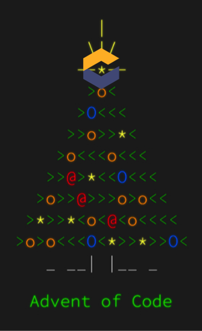

# Che Advent of Code 2020

Solving the Advent of Code 2020 has never been easier.

Click here :point_down: to start an IDE in your browser.

Getting stuck with today's puzzle? Come and chat with us :muscle: [here](https://mattermost.eclipse.org/eclipse/channels/eclipse-che)

## The Advent of Code

From https://adventofcode.com/2020/about

> Advent of Code is an Advent calendar of small programming puzzles for a variety of skill sets and skill levels that can be solved in any programming language you like. People use them as a speed contest, interview prep, company training, university coursework, practice problems, or to challenge each other.

## Eclipse Che

Eclipse Che provides one-click developer workspaces and eliminates local environment configuration for your entire team. Che brings an in-browser IDE, allowing you to code, build, test and run applications from any machine. Che supports a large number of languages through VisualStudio Code extensions.

